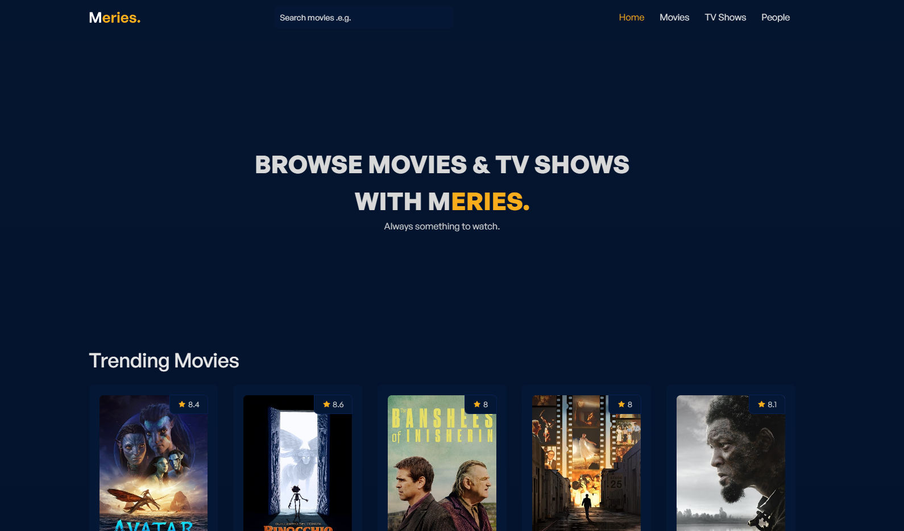

# Meries.

Meries is a website that allows users to search for movies, tv shows and people as well as browsing popular and trending media.

## Tech Stack

React and SCSS.

API used https://www.themoviedb.org/

    

## To do

- Add sorting by genres.
- Add filtering by popularity, release date etc.
- Add "watch trailer" on details page.
